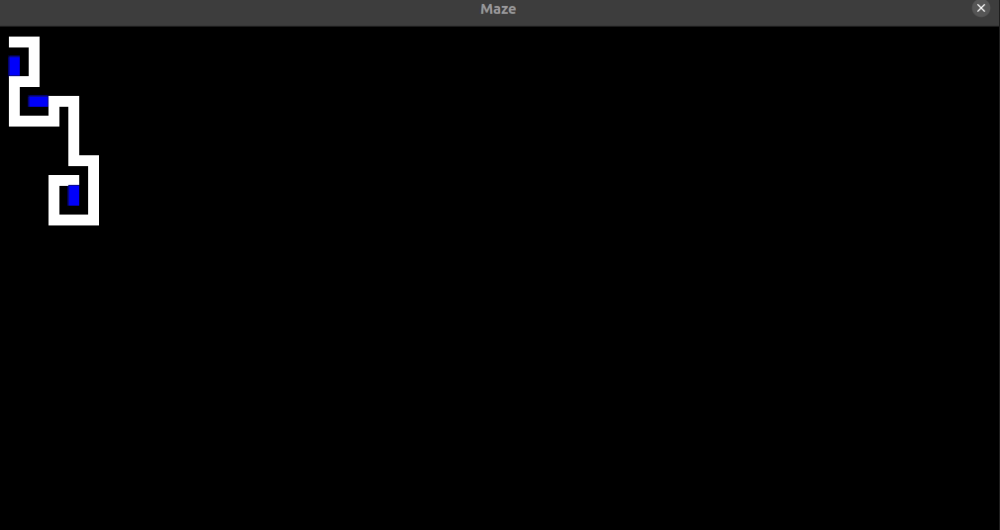

# GenerateMaze
Written in python3 by Ben Whittington, October 2018. I did not write graphics.py

This is an implementation of a randomised depth first search for generating mazes.

To run simply run makeMaze.py with all the other files in the same directory.

